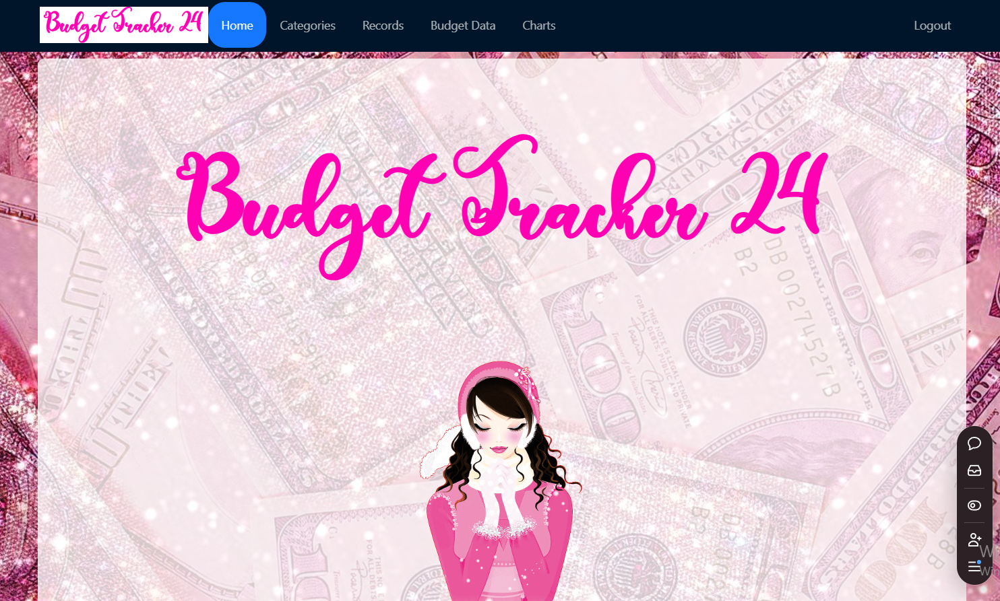
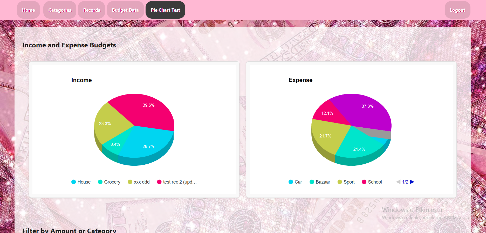

# Expense Tracker Application  

This is a **full-stack expense tracker application** designed to help users monitor their income and expenses efficiently. The project was developed using **Node.js**, **Express.js**, **MongoDB**, and **React**. It includes features like user authentication, budget tracking, dynamic visualizations, and a responsive interface.  

### 🌐[Live Demo](https://expense-tracker-frontend-coral-two.vercel.app/)

---

  
---
  

---

## Features  
### Backend  
- **Secure Authentication**: User registration and login using **bcrypt** and **JWT**.  
- **RESTful API**: CRUD operations for income and expense records with proper validations.  
- **Data Management**: MongoDB database for efficient data storage and retrieval.  

### Frontend  
- **Dynamic Charts**: Uses Google Charts to display income and expense data as pie charts, column charts, and tables.  
- **Responsive Design**: Adapts seamlessly to different devices and screen sizes.  
- **Real-Time Updates**: Reflects changes in income and expense data instantly.  

### General Features  
- **Category Management**: Income and expenses are categorized for detailed insights.  
- **Data Visualization**: Allows filtering and viewing data interactively with controls.  

---

## Installation  

1. Clone the repository:  
   ```bash  
   git clone https://github.com/salihakotan/expense-tracker-frontend.git  
   cd expense-tracker
   npm install
   npm start

## Usage
Register as a new user or log in with existing credentials.
Add your income and expense records, categorized as "Income" or "Expense."
Visualize your financial data using interactive charts and tables.
Monitor your total, income, and expense budgets dynamically.
Project Structure
backend/: Contains server-side code, API routes, and database models.
frontend/: Contains client-side code, React components, and styles.
Example Data Visualization

## Deployment
The application can be deployed using platforms like Vercel, Netlify, or Heroku. Ensure to set up environment variables (e.g., MongoDB URI, JWT_SECRET) in the respective platform.

## Contributing
Feel free to fork the repository and submit pull requests for improvements.

## License
This project is licensed under the MIT License.

## Contact
For questions or feedback, reach out via salihakotan77@gmail.com
